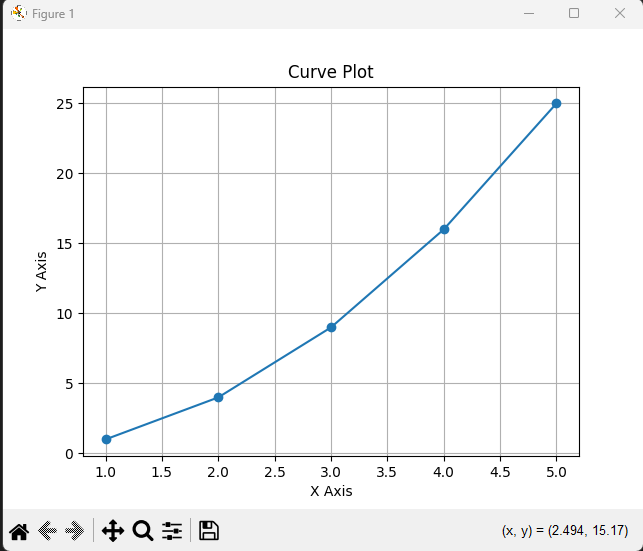
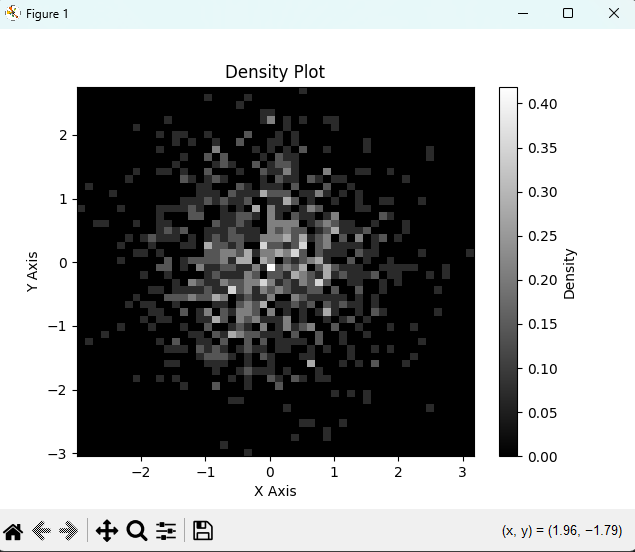
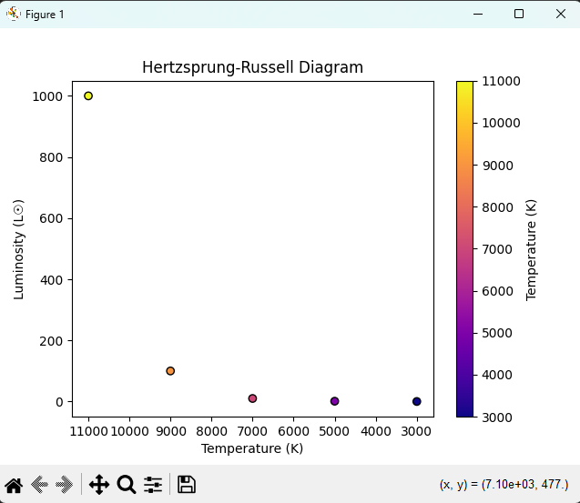

# Programming in Science - Lab 10

This template repository is the starter project for **Programming in Science Lab 10**. Written in Python and tested with Pytest.

### Question(s)

1. **(30%)** Curve Plotting:
   
   - Write a function `plot_curve(x_values, y_values)` that plots a given mathematical function using `plot()` and `show()`.
   
   #### Example:
   ```python
   plot_curve([1, 2, 3, 4, 5], [1, 4, 9, 16, 25])  # Plots a y = x^2 curve
   ```
   

   ✅ **Hints:** Use Matplotlib to plot the function and ensure axes are labeled.

2. **(30%)** The Hertzsprung-Russell Diagram:
   
   - Write a function `plot_hr_diagram(temperature, luminosity)` that generates a Hertzsprung-Russell diagram from given star data.
   
   #### Example:
   ```python
   plot_hr_diagram([5000, 6000, 7000, 8000], [1.0, 1.5, 2.0, 2.5])
   ```
   

   ✅ **Hints:** Use a scatter plot with temperature on the x-axis (decreasing) and luminosity on the y-axis.

3. **(40%)** Creating Heat Maps and Density Plots:
   
   - Write a function `plot_density(data, color_map)` that generates a density plot using a heat map with a chosen color scheme.
   
   #### Example:
   ```python
   plot_density(sample_data, 'gray')
   ```
   

   ✅ **Hints:** Use 2D histograms or KDE plots to visualize density.

### Run Command

To run the tests, use the following command:

```
pytest
```

